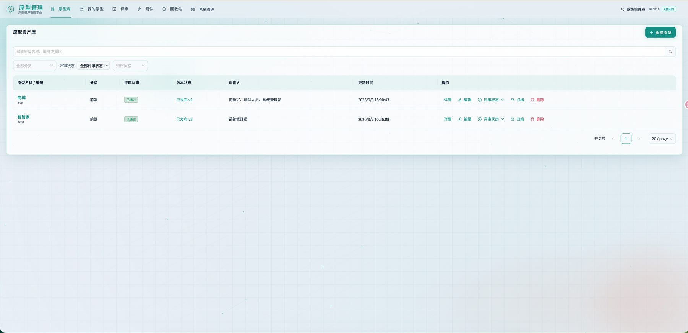
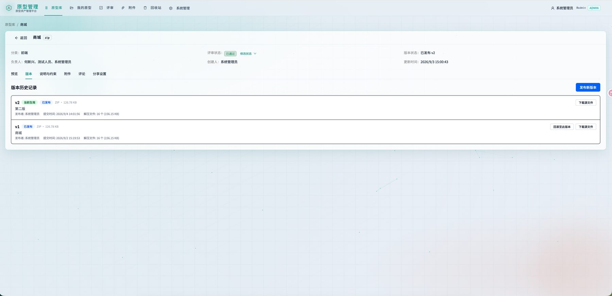
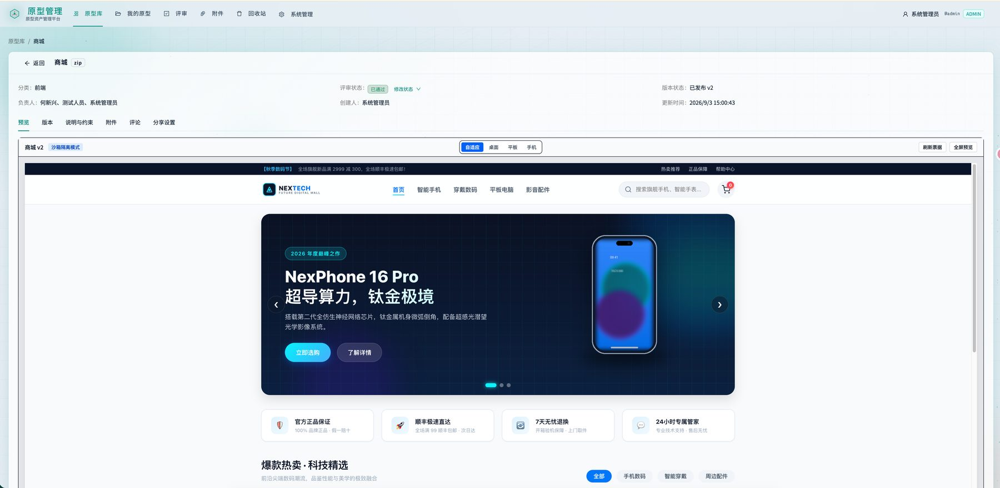
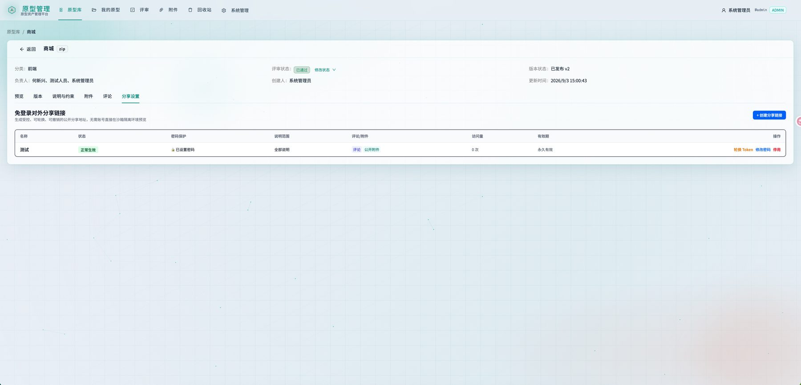
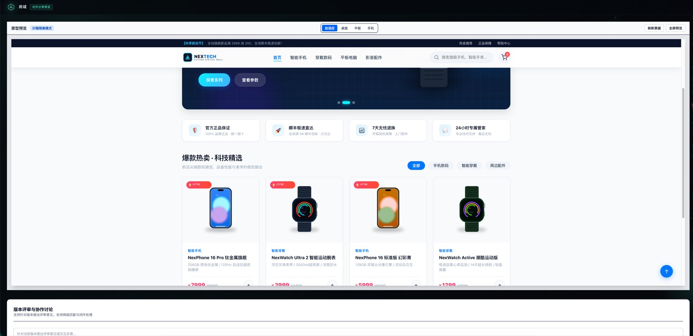
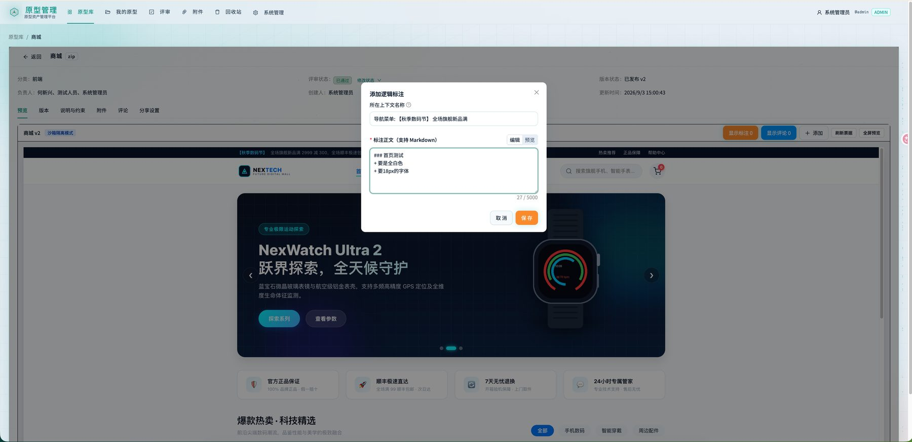
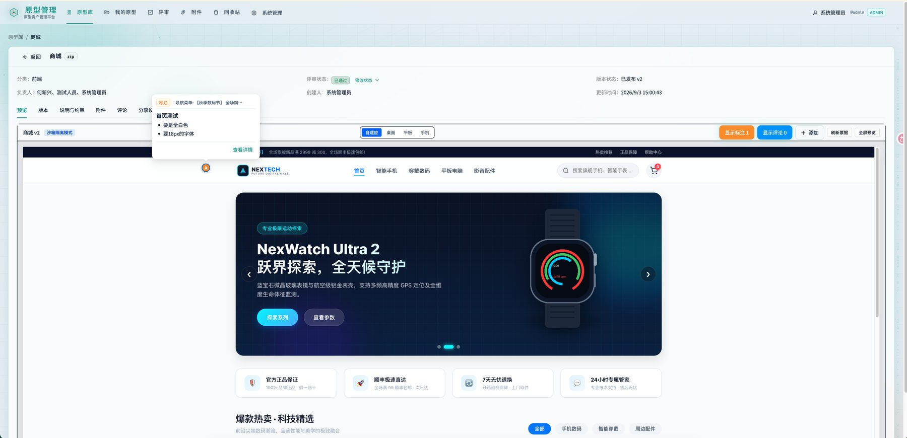
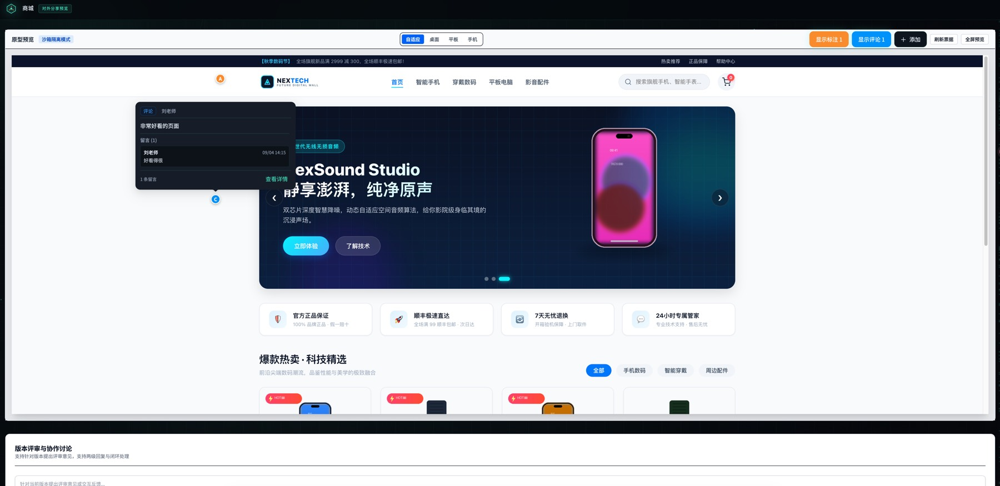

# 原型资产管理平台

面向 AI 生成 HTML 原型的版本化管理、沙箱预览、评审协作与安全分享。

开源核心覆盖资产库、版本发布、隔离预览、评论、附件和对外分享。画面上的**空间标注 / 定位评论**是商业功能，不包含在本开源仓库中。

## 界面预览

### 原型资产库



### 版本管理与沙箱预览





### 对外分享






## 开源功能

- 原型资产库：分类、标签、评审状态、归档与回收站
- 版本流水线：上传 ZIP/HTML、发布、回滚、沙箱隔离预览
- 协作：版本评论、附件库、结构化说明
- 分享：口令保护、可撤销链接、访客预览
- 权限：管理员 / 创建人 / 查看者，双域隔离（管理域与预览域）
- 外观：暗场科技主题与日光主题，可跟随系统

## 商业功能：空间标注（不开源）

开源版可以把评论写在版本上，但不能点到画面里的某个按钮、菜单或弹窗上。商业版在预览层叠加标注点与定位评论，不改用户上传的原型源文件。







包含：

- 逻辑标注：解释流程、交互规则和业务约束
- 定位评论：点在当前画面位置上讨论，支持回复与处理状态
- 分享场景下的标注展示与评论权限
- 标注按版本管理，支持跨版本迁移

**本开源仓库不包含上述实现。** 需要授权、私有部署或二次开发，请联系：

- GitHub：[hxx30992670](https://github.com/hxx30992670)
- 邮箱：hexinxing3086@gmail.com
- 微信：不忘初心

<p align="left">
  
</p>

## 技术栈

| 层 | 技术 |
| --- | --- |
| 前端 | React 19、Vite、Ant Design、Tailwind CSS、TanStack Query |
| 后端 | Java 21、Spring Boot（API、发布 Worker、预览网关） |
| 数据 | MySQL、Redis、MinIO |
| 交付 | Docker Compose、Nginx 双域反向代理 |

## 快速开始

详细步骤见 [本地开发手册](docs/runbooks/local-development.md)。摘要：

```bash
cp -n .env.dev.example .env.dev
docker compose --env-file .env.dev -f infra/compose/docker-compose.dev.yml up -d
# IDEA 运行 com.company.prototype.localdev.LocalDevApplication（JDK 21）
corepack enable
pnpm install
pnpm --filter @prototype/web dev
```

浏览器打开 `http://prototype.localhost:18000`（不要直接用 `127.0.0.1:5173`）。

默认引导账号见 `.env.dev.example` 中的 `BOOTSTRAP_ADMIN_USERNAME` / `BOOTSTRAP_ADMIN_PASSWORD`。请只在本地环境文件中修改密码，不要把 `.env.dev` 提交进仓库。

## 仓库说明

| 仓库 | 可见性 | 内容 |
| --- | --- | --- |
| 本仓库 | 公开 | 开源核心（仅 `master`） |
| 商业版仓库 | 私有 | 空间标注完整实现，需授权后访问 |

公开仓库只发布 `master`。请不要把 `develop` 或标注相关分支推送到本仓库。GitHub 公开仓库没有私有分支。

## 文档

- [本地开发](docs/runbooks/local-development.md)
- [备份恢复](docs/runbooks/backup-and-restore.md)
- [HTTPS 迁移](docs/runbooks/https-migration.md)

## 许可

开源核心以 [MIT](LICENSE) 发布。空间标注属于独立商业能力，不在本许可证范围内。

架构与设计：不忘初心（toms he）
